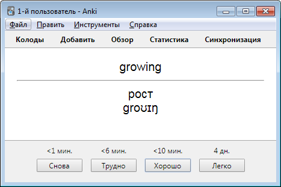
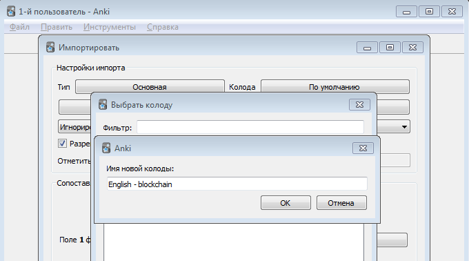
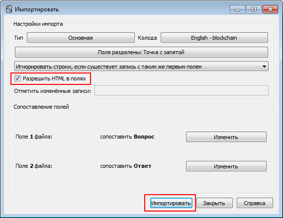
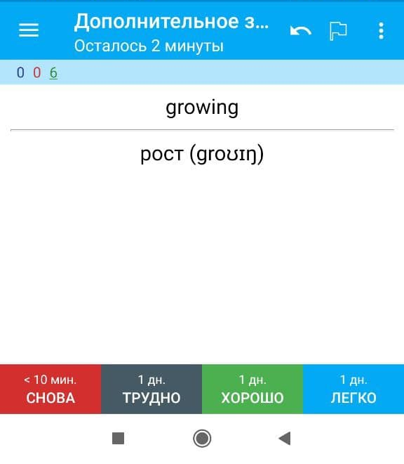

# translate_article

Helper python tool for translate web page from english to russian in educatinal purposes

Original page (fragment)

Page after processing (fragment)

## Installation

1. Install python
2. Install libraries:
* nltk
* beautifulsoup4
* eng-to-ipa

## Usage

1. Save desired web-page from browser to disk (html only)
2. Run `python preprocess.py`
3. Enter path to the saved web-page when prompted
4. Enter CSS-selector for page main content. You can use developer tools from browser for it
5. Mark words from page as known (`y`) or unknown (`n`). Type `stop` for interrupt
6. When Google Translate web-page opened copy translation to clipboard
7. Paste translation to prompt
8. Prepared page will be saved near the original page

If you want to get **pdf** from processed page, use **Print to pdf function** in your browser.

## Use as dictionary for learning words

You can open file `unknown.txt` in Excel to use it as dictionary for learning words. See screenshot below:

## Use as Anki flashcards

If you want to use method of [Spaced repetition](https://en.wikipedia.org/wiki/Spaced_repetition) for study words, you can
convert your `unknown.txt` dictionary to [Anki flashcards](https://apps.ankiweb.net/).

Step-by-step manual:
1. Download and install Anki from [official site](https://apps.ankiweb.net/)
2. Run `convert_to_anki.py`. It will produce file `anki.txt`
3. In Anki click File -> Import... and select file `anki.txt`. Don't forget to select "HTML in fields" checkbox:

4. Now you can use your new deck to study words

You also can import your deck to mobile app

